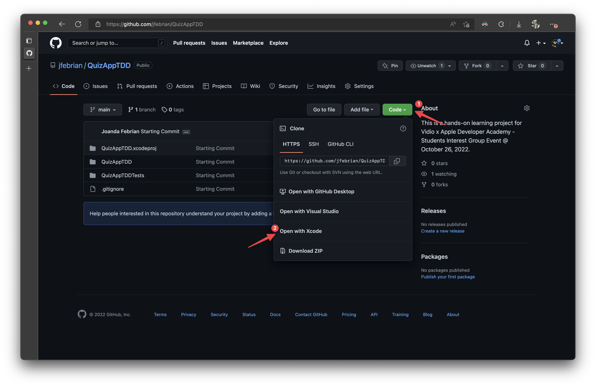
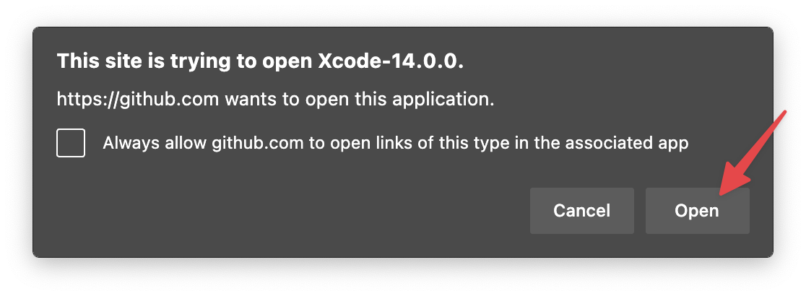
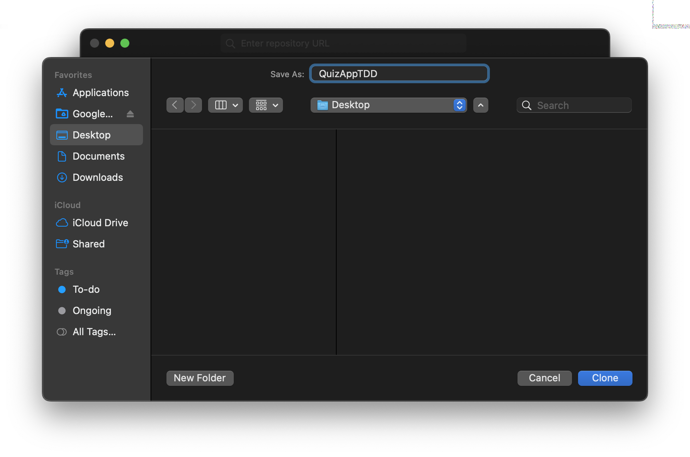
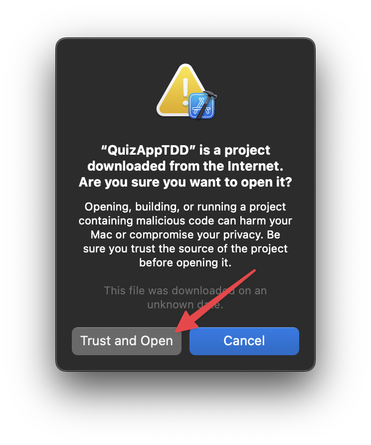

# Apple Academy SIG Event

## Technical Hands-on Activity

In this hands-on activity, we'll try to implement a feature and fix a bug with *Test-Driven Development (TDD)* approach.

### Installing the Xcode Project

First, you'll need to be able to access this project in your local Xcode.

1. Clone this project to your local directory. You can use GitHub's `Open in Xcode` feature. *Note: Clone the **main** branch first. You can clone the finished project after this event if you want*
   
   

2. Tap `Open` when your browser is asking for permission.
   
   

3. You can save it anywhere you want and name it anything.
   
   

4. Then when Xcode shows a warning, tap `Trust and Open`. This warning is always shown when you open an Xcode project online.
   
   

## Tasks

In this hands-on project, we will have two tasks that we should complete using Test-Driven Development approach:

### Implement Scoring & Combo Feature

The first task is for you to implement a scoring feature in the Quiz App. Here are the acceptance criteria:

---

> *Given*: Player is not playing a game 
> 
> *When*: Player starts a game 
> 
> *Then*: Player initial score, combo bonus, and combo multiplier set to 0

---

> *Given*: Player is playing a game
> 
> *When*: Player selects a correct answer
> 
> *Then*: Player score increases by 10

---

> *Given*: Player is playing a game 
> 
> *When*: Player selects correct answer 
> 
> *Then*: Player combo bonus increases by 5 times combo multiplier

---

> *Given*: Player selected correct answer 
> 
> *When*: Player selects another correct answer 
> 
> *Then*: Player combo multiplier increases by 1

---

> *Given*: Player is playing a game
> 
> *When*: Player selects a wrong answer
> 
> *Then*: Player score decreases by 5

---

> *Given*: Player selected correct answer 
> 
> *When*: Player selects a wrong answer 
> 
> *Then*: Player score increases by combo bonus

---

> *Given*: Player selected correct answer 
> 
> *When*: Player selects a wrong answer 
> 
> *Then*: Player combo bonus and multiplier resets to 0

---

> *Given*: Player is playing a game
> 
> *When*: Player ends the game
> 
> *Then*: Player score added by the current combo bonus

---

### Fix Bugs

There is a bug inside the `GameProgressView`, where the progress bar does not move during the quiz. Try to fix it with the *Test-Driven Development* approach!

| Current Behavior                                         | Expected Behavior                                         |
|:--------------------------------------------------------:|:---------------------------------------------------------:|
|  |  |
